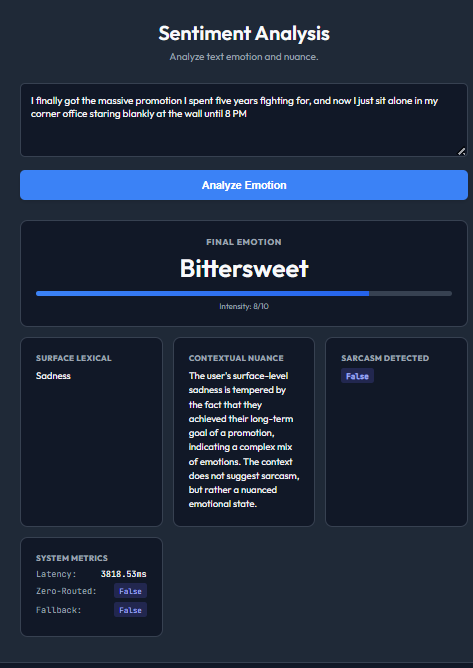
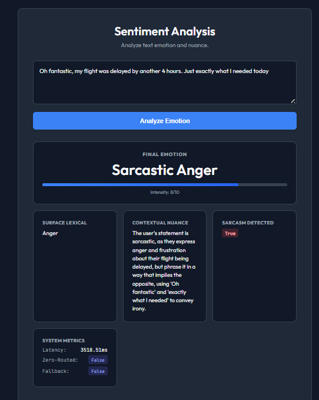

# Sentiment Analysis Engine

A production-grade, highly concurrent, Multi-Agent AI architecture designed to capture extreme nuance in human text.

## Architectural Overview

The core philosophy of this engine is that simple, single-pass LLM prompts or static ML models are insufficient for parsing complex human emotions such as sarcasm, passive aggression, or paradoxical joy. To solve this, the backend implements a deterministic, multi-agent state graph that debates and refines its own output before returning a response to the user.

This project utilizes FastAPI for high-throughput asynchronous execution, LangGraph for agent orchestration, and ChromaDB for both Retrieval-Augmented Generation (RAG) and Semantic Caching.

## Engineering Methods & Core Features

### 1. Multi-Agent Swarm (LangGraph Orchestration)
Instead of a single LLM call, the system utilizes a compiled LangGraph state machine. The state is strictly managed using a Python `TypedDict`, ensuring that data passed between agents is immutable and predictable.
*   **Surface Lexical Agent:** This agent acts as the baseline. It performs a rapid, literal dictionary-definition analysis of the text (e.g., classifying "happy crying" strictly as Sadness or Joy based on word weight).
*   **Contextual Nuance Agent:** This agent receives the Lexical Agent's baseline and acts as the critic. It is prompt-engineered with advanced psychological directives (such as the "Tears of Joy Rule" and "Idiomatic Sarcasm Rule"). It cross-references the literal analysis against historical RAG data to detect contradictions, ultimately having the power to override the Lexical Agent if sarcasm or subtext is detected.

### 2. Retrieval-Augmented Generation (RAG)
To provide the Contextual Nuance Agent with a frame of reference, the system uses a localized vector database (ChromaDB).
*   **Multi-Index Search:** The system is seeded with multiple Kaggle datasets (`GoEmotions`, `Sentiment140`, and a dedicated `Sarcasm` dataset). During a query, the backend performs simultaneous similarity searches across these independent collections.
*   **Raw Cosine Distance:** Results are aggregated and ranked globally using raw cosine distance rather than batch-normalized metrics, preventing skewed rankings and ensuring only the most highly relevant historical context is injected into the LLM prompt.

### 3. Semantic Caching (Zero-Routing)
To drastically reduce latency and API costs, the system implements a localized Semantic Router.
*   **Vectorized Interception:** Before a request reaches the LangGraph orchestration layer, the user's text is vectorized and compared against a ChromaDB collection of previously resolved queries.
*   **Zero-Routing:** If the cosine similarity of the incoming query matches a cached query above a strict threshold (e.g., 0.95), the system short-circuits. It bypasses the LLM network entirely and instantly returns the cached multi-agent payload.
*   **Performance Impact:** This reduces response latency from ~3,500ms down to ~100ms.

### 4. Circuit Breaker & Fallback Architecture
To ensure 100% uptime, the system implements a stateful Circuit Breaker pattern.
*   **Telemetry Tracking:** A global `BenchmarkTracker` monitors the success and failure rates of the primary LLM provider (Groq). 
*   **Fail-Fast Mechanism:** If the primary provider triggers a rate limit (HTTP 429) or an outage, the circuit trips to the `OPEN` state. 
*   **Graceful Degradation:** Once open, all traffic is instantly re-routed to a pre-cached Fallback Chain. This fallback relies on a highly conservative prompt to provide safe, baseline sentiment analysis until the primary circuit heals.

### 5. Asynchronous Concurrency
The entire backend was built for high throughput.
*   **Event Loop Optimization:** FastAPI routes are defined using `async def`, allowing the server to juggle multiple concurrent users.
*   **Non-Blocking I/O:** Database interactions (via LangGraph's `AsyncSqliteSaver`) and LLM network requests (via `ainvoke`) are fully asynchronous, preventing threadpool starvation during heavy load spikes.

## System Evolution & History

Originally, this repository hosted an older monolithic architecture utilizing a standard Python Machine Learning server paired with a heavy C++ client. That legacy system relied on basic, rigid ML models to predict emotion based on static vocabularies. It suffered from severe limitations:
*   Inability to understand sarcasm or complex idioms.
*   Required compiling massive C++ and OpenGL dependencies.
*   Static knowledge base unable to adapt to modern internet context.

The heavy C++ client was completely scrapped in favor of a clean, minimalist Vanilla JS/CSS frontend. The backend was refactored into the current Python/FastAPI architecture, replacing static ML models with the intelligent LangGraph swarm.

## Future Roadmap

While the architecture is highly resilient, there are ongoing areas for improvement:
1.  **Rate Limit Bottlenecks:** Heavy load testing (via Locust) currently triggers API rate limits on free-tier LLM providers. Transitioning the primary or fallback chains to fully localized, quantized models (e.g., Ollama) would remove all network dependencies and rate limits.
2.  **Embedding Latency:** Local text embeddings (via `sentence-transformers`) require CPU computation. Offloading embedding generation to a dedicated GPU would further reduce the cold-start RAG latency.
3.  **Language Expansion:** The Contextual Nuance Agent is heavily prompt-engineered for English psychological rules. Scaling to multi-language support will require localized RAG datasets and language-specific nuance prompting.

## Demonstrations

Below are examples of the system successfully parsing complex edge cases:

*The Contextual Agent successfully overriding a physical reaction (crying) due to explicit positive statements.*

*The system correctly identifying sarcastic outrage and overriding the Lexical Agent.*
